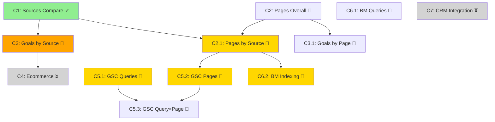

# Capability Matrix — гипотезы × данные × capabilities

**Назначение:** Карта для агента: какая гипотеза какими данными проверяется и через какие capabilities.

**Обновлено:** 2025-12-26

---

## 1. Полный список гипотез (из seo_hypothesis_library.md)

### Сигнал S1: Общий трафик упал

| ID | Гипотеза | Краткое описание |
|----|----------|------------------|
| H1.1 | Спрос/сезонность | Падение распределено равномерно |
| H1.2 | Потеря видимости в поиске | Падение в органике + топ-страницах |
| H1.3 | Техническая деградация | Растут отказы, падает глубина/время |
| H1.4 | Атрибуция/UTM/редиректы | Смена распределения каналов |
| H1.5 | Потеря реферальных источников | Резко падает Link traffic |
| H1.6 | Маркетинг закончился | Падает Ad/Social/Messenger |

### Сигнал S2: Органический трафик упал

| ID | Гипотеза | Краткое описание |
|----|----------|------------------|
| H2.1 | Просадка по кластерам страниц | Топ входов показывает концентрацию |
| H2.2 | Падение показов | Показы падают, позиции стабильны |
| H2.3 | Падение позиций | Позиции ухудшились |
| H2.4 | CTR просел | CTR падает, позиции стабильны |
| H2.5 | Индексация/canonical/robots | Страницы выпали из индекса |

### Сигнал S3: Яндекс упал, Google стабилен (или наоборот)

| ID | Гипотеза | Краткое описание |
|----|----------|------------------|
| H3.1 | Алгоритмические изменения ПС | Падение в одной ПС |
| H3.2 | Региональность/персонализация | CTR/позиции асимметрично |
| H3.3 | Индексация отличается | Больше исключённых в одной ПС |
| H3.4 | Технические требования ПС | Корреляция с CWV/скоростью |

### Сигнал S4: Трафик стабилен, конверсия упала

| ID | Гипотеза | Краткое описание |
|----|----------|------------------|
| H4.1 | Поломка оплаты/корзины | Падают транзакции/доход |
| H4.2 | Смена микса трафика | Источники/страницы сместились |
| H4.3 | Ошибки трекинга | CR падает в отчёте, но не в CRM |
| H4.4 | UX/контент/оффер | Поведение ухудшается на ключевых |

### Сигнал S5: Падение в нескольких страницах

| ID | Гипотеза | Краткое описание |
|----|----------|------------------|
| H5.1 | Страницы потеряли позиции | Клики/показы/позиции ухудшились |
| H5.2 | Выпали из индекса | Резкий обрыв органики |
| H5.3 | Изменения на странице | Конверсия меняется, показы стабильны |

### Сигнал S6: Link traffic резко упал

| ID | Гипотеза | Краткое описание |
|----|----------|------------------|
| H6.1 | Удалили ссылки | Выпадение нескольких рефдоменов |
| H6.2 | Редиректы/HTTPS/UTM | Рефералы "перетекают" в Direct |

### Сигнал S7: Direct traffic аномально вырос/упал

| ID | Гипотеза | Краткое описание |
|----|----------|------------------|
| H7.1 | Сломалась разметка | Платный/реферальный стал Direct |
| H7.2 | Брендовый спрос изменился | Растёт брендовая органика |

### Сигнал S8: Отказы выросли / глубина упала

| ID | Гипотеза | Краткое описание |
|----|----------|------------------|
| H8.1 | Техническая деградация | Ошибки, скорость, мобайл |
| H8.2 | Нерелевантный трафик | Изменился микс источников/страниц |
| H8.3 | Изменения на посадочных | Контент/UX изменился |

---

## 2. Capability Matrix (таблица)

### Легенда

**Статус capability:**
- ✅ Реализовано
- 🔄 Планируется (Tier 1-2)
- ⏳ Tier 3 (будущее)
- ❌ Нет данных

**Приоритет:**
- 🔴 Критично
- 🟠 Важно
- 🟡 Средне
- 🟢 Низкий

---

### Матрица: Гипотеза → Данные → Capability → Приоритет

| Гипотеза | Данные (dimensions × metrics × source) | Capability | Статус | Приоритет |
|----------|----------------------------------------|------------|--------|-----------|
| **H1.1** | sources × visits/users (Метрика) | C1 | ✅ | 🔴 |
| **H1.2** | sources × visits (Метрика) + pages × clicks/pos (GSC/ВМ) | C1 + C5.2 + C6.1 | ✅ / 🔄 | 🔴 |
| **H1.3** | sources × bounceRate/pageDepth/duration (Метрика) | C1 | ✅ | 🔴 |
| **H1.4** | sources × visits (Метрика) | C1 | ✅ | 🔴 |
| **H1.5** | sources × visits (Метрика, filter Link traffic) | C1 | ✅ | 🟠 |
| **H1.6** | sources × visits (Метрика, filter Ad/Social) | C1 | ✅ | 🟠 |
| **H2.1** | **startURL × visits (filter: Search engine traffic)** | **C2.1** | **🔄** | **🔴** |
| **H2.2** | query × impressions/position (GSC/ВМ) | C5.1 + C6.1 | 🔄 | 🔴 |
| **H2.3** | query × position (GSC/ВМ) | C5.1 + C6.1 | 🔄 | 🔴 |
| **H2.4** | query × ctr/position (GSC/ВМ) | C5.1 + C6.1 | 🔄 | 🔴 |
| **H2.5** | EXCLUDED URLs (ВМ) + startURL × visits (Метрика) | **C6.2** + C2.1 | **🔄** | **🔴** |
| **H3.1** | query × clicks/pos (GSC vs ВМ side-by-side) | C5.1 + C6.1 | 🔄 | 🔴 |
| **H3.2** | query × ctr/pos (GSC vs ВМ) | C5.1 + C6.1 | 🔄 | 🟠 |
| **H3.3** | EXCLUDED URLs (ВМ) vs GSC indexing | C6.2 + (GSC indexing API) | 🔄 / ❌ | 🟠 |
| **H3.4** | Требует внешние данные (CWV, PageSpeed) | — | ❌ | 🟡 |
| **H4.1** | ecommerce × purchases/revenue (Метрика) | **C4** | **⏳** | 🟠 |
| **H4.2** | sources × visits + goals (Метрика) | C1 + **C3** | ✅ / 🔄 | 🟠 |
| **H4.3** | goals (Метрика) vs CRM data | C3 + **C7** | 🔄 / ⏳ | 🟠 |
| **H4.4** | startURL × goal CR/bounceRate (Метрика) | **C3.1** | **🔄** | 🟠 |
| **H5.1** | page × clicks/pos (GSC/ВМ) | C5.2 + C6.1 | 🔄 | 🔴 |
| **H5.2** | EXCLUDED URLs (ВМ) | **C6.2** | **🔄** | **🔴** |
| **H5.3** | startURL × goal CR (Метрика) | C3.1 | 🔄 | 🟠 |
| **H6.1** | referer domains × visits (Метрика) | (расширение C1) | ⏳ | 🟡 |
| **H6.2** | sources (Direct vs Link) × visits (Метрика) | C1 | ✅ | 🟡 |
| **H7.1** | sources (Direct/Ad/Link) × visits (Метрика) | C1 | ✅ | 🟡 |
| **H7.2** | query (brand) × shows/clicks (GSC/ВМ) | C5.1 + C6.1 (filter brand) | 🔄 | 🟡 |
| **H8.1** | startURL × bounceRate/device (Метрика) | C2 + (device filter) | 🔄 / ⏳ | 🟠 |
| **H8.2** | sources × bounceRate (Метрика) | C1 | ✅ | 🟠 |
| **H8.3** | startURL × bounceRate/pageDepth (Метрика) | C2 | 🔄 | 🟡 |

---

## 3. Граф зависимостей capabilities

**Легенда:**
- Зелёный: Реализовано
- Жёлтый: Tier 1 (критично)
- Оранжевый: Tier 2 (важно)
- Серый: Tier 3 (будущее)

---

## 4. Блокеры профессионального анализа (текущее состояние)

### 🚫 Блокер 1: C2.1 (Pages by source) — критично

**Что блокирует:**
- H2.1 (кластеры страниц в органике) — **основная гипотеза падения органики**
- H5.1 (страницы потеряли позиции)
- Невозможно найти конкретные landing pages-драйверы в органике

**Решение:** Реализовать **Tier 1, приоритет 1**

**Данные:**
- Метрика: `dimensions=ym:s:startURL`, `filters=ym:s:lastTrafficSource=='Search engine traffic'`

---

### 🚫 Блокер 2: C5.1, C5.2 (GSC) — критично

**Что блокирует:**
- H2.2, H2.3, H2.4 (позиции/CTR/показы) — **причины падения органики**
- H3.* (Яндекс vs Google)
- Невозможно объяснить WHY упали страницы/источники

**Решение:** Реализовать **Tier 1, приоритет 2**

---

### 🚫 Блокер 3: C6.1, C6.2 (Вебмастер) — критично для РФ

**Что блокирует:**
- H2.5 (индексация) — **единственный способ проверить**
- H3.* (Яндекс vs Google)
- H5.2 (выпали из индекса)

**Решение:** Реализовать **Tier 1, приоритет 3**

---

### ⚠️ Ограничение 4: C3 (Goals) — важно

**Что блокирует:**
- H4.2 (смена микса трафика)
- H4.4 (UX/контент)
- Проверка качества трафика (конверсии по источникам)

**Решение:** Реализовать **Tier 2**

---

### ⏳ Будущее: C4 (Ecommerce), C7 (CRM)

**Что блокирует:**
- H4.1 (поломка оплаты)
- H4.3 (ошибки трекинга)

**Решение:** **Tier 3** (после стабилизации Tier 1-2)

---

## 5. Минимальный набор для профессионального уровня

### Кейс: "Падение органики partacademy -36.6%"

**Чтобы расследовать профессионально, агент ОБЯЗАН иметь:**

1. **C1 (Sources)** ✅ — подтвердить, что органика упала
2. **C2.1 (Pages by source)** 🔄 — найти страницы-драйверы в органике
3. **C5.1 (GSC queries)** 🔄 — какие запросы упали (позиции/CTR/показы)
4. **C5.2 (GSC pages)** 🔄 — позиции по страницам (Google)
5. **C6.1 (ВМ queries)** 🔄 — какие запросы упали (Яндекс)
6. **C6.2 (ВМ indexing)** 🔄 — проверить индексацию (если Яндекс упал)

**С этим минимумом агент может:**
- Сказать: "Упали 3 страницы: /page1, /page2, /page3"
- Сказать: "По запросам X, Y, Z позиции упали с 5 до 15"
- Сказать: "Причина: позиции упали" ИЛИ "Причина: страницы выпали из индекса"

**Без этого минимума:**
- Агент может только сказать "органика упала", как и обычный отчёт Метрики
- **НЕ профессиональный уровень**

---

## 6. Roadmap приоритизации

### Tier 1: Критично для профессионального анализа органики

| Capability | Приоритет | Данные | Блокирует гипотез |
|------------|-----------|--------|-------------------|
| **C2.1** Pages by source | **1** | Метрика (filter) | H2.1, H5.1 |
| **C5.1** GSC Queries | **2** | GSC API | H2.2, H2.3, H2.4, H3.* |
| **C5.2** GSC Pages | **2** | GSC API | H2.1, H5.1 |
| **C6.1** ВМ Queries | **3** | ВМ API | H2.*, H3.* (Яндекс) |
| **C6.2** ВМ Indexing | **3** | ВМ API | H2.5, H5.2 |

**Критерий Tier 1:** Без этих capabilities агент НЕ может работать на профессиональном уровне.

---

### Tier 2: Важно для полноты анализа

| Capability | Приоритет | Данные | Блокирует гипотез |
|------------|-----------|--------|-------------------|
| **C2** Pages Overall | **4** | Метрика | H1.2, H5.3, H8.3 |
| **C3** Goals by Source | **5** | Метрика (goals) | H4.2, H4.4 |
| **C3.1** Goals by Page | **6** | Метрика (goals) | H5.3 |
| **C5.3** GSC Query×Page | **7** | GSC API | Детализация H2.*, H5.* |

**Критерий Tier 2:** Расширяет анализ, позволяет проверять больше гипотез (конверсии, детализация).

---

### Tier 3: Расширение (будущее)

| Capability | Приоритет | Данные | Блокирует гипотез |
|------------|-----------|--------|-------------------|
| **C4** Ecommerce | **8** | Метрика (ecommerce) | H4.1 |
| **C7** CRM Integration | **9** | CRM/платёжка | H4.3 |
| Device filters | **10** | Метрика (device) | H8.1 |
| Geo analysis | **11** | Метрика/GSC (geo) | Региональные |

**Критерий Tier 3:** Нужно только для специфичных кейсов (ecommerce, CRM-валидация, гео).

---

## 7. Зависимости между capabilities

### Последовательность реализации

**Порядок:**
1. C1 ✅ (уже есть)
2. **C2.1** (зависит от: понимания фильтров Метрики)
3. **C5.1, C5.2** (параллельно, независимо)
4. **C6.1, C6.2** (параллельно, независимо)
5. C2 (после C2.1, т.к. логика похожа)
6. C3, C3.1 (после C1, C2 — аналогичная структура)

**Параллелизм:**
- C5.* (GSC) и C6.* (ВМ) можно реализовывать параллельно (разные API)
- C2.1 и C5.1 можно делать параллельно

---

## 8. Пример использования матрицы агентом

### Входной запрос пользователя:
> "Разберись, почему упала органика partacademy в декабре 2025"

### Шаг 1: Intake → определить сигналы и гипотезы

**Сигнал:** S2 (органический трафик упал)

**Приоритетные гипотезы:**
- H2.1 (кластеры страниц)
- H2.3 (позиции упали)
- H2.5 (индексация)

---

### Шаг 2: Query Planning → найти capabilities в матрице

**Гипотеза H2.1:**
- Capability: **C2.1** (Pages by source)
- Данные: Метрика, `startURL` × `visits`, filter `Search engine traffic`
- Статус: 🔄 Tier 1 (реализовать)

**Гипотеза H2.3:**
- Capability: **C5.1** (GSC Queries), **C6.1** (ВМ Queries)
- Данные: GSC/ВМ, `query` × `position`
- Статус: 🔄 Tier 1 (реализовать)

**Гипотеза H2.5:**
- Capability: **C6.2** (ВМ Indexing)
- Данные: ВМ, EXCLUDED URLs
- Статус: 🔄 Tier 1 (реализовать)

---

### Шаг 3: Проверка доступности

**C1:** ✅ Есть → запустить  
**C2.1:** ❌ Нет → **Capability missing** (добавить в отчёт)  
**C5.1, C6.1, C6.2:** ❌ Нет → **Capability missing**

---

### Шаг 4: Execution

**Текущий запуск:**
- C1: `analyze-sources partacademy 2024-12-01 2024-12-25 2025-12-01 2025-12-25`
- Результат: органика упала на 36.6%

**Следующие шаги (Capability missing):**
- Реализовать C2.1 → найти страницы
- Реализовать C5.1, C6.1 → найти запросы/позиции
- Реализовать C6.2 → проверить индексацию

---

## 9. Вывод: приоритетная очередь для агента

**Сейчас (реализовано):**
- C1 (Sources) ✅

**Tier 1 (критично, делать сейчас):**
1. **C2.1** (Pages by source) — первая priority
2. **C5.1, C5.2** (GSC) — вторая priority
3. **C6.1, C6.2** (Вебмастер) — третья priority

**После Tier 1:**
4. Orchestrator (intake → plan → execute → analyze → report)
5. Tier 2 (C2, C3, C3.1)

**Критерий успеха Tier 1:**
Агент на запрос "Почему упала органика?" выдаёт:
- Конкретные страницы (C2.1)
- Конкретные запросы (C5.1, C6.1)
- Конкретные причины (позиции упали / выпали из индекса)
- Всё подтверждено evidence

