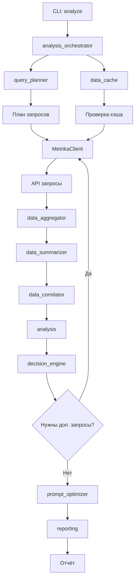

# Архитектура умных модулей Analyzer Machine

Документ описывает архитектуру дополнительных модулей для автоматического определения запросов, эффективной работы с большими данными и минимизации токенов LLM.

## Проблема

Текущая архитектура имеет ограничения:
- Требует ручного указания какие запросы делать
- Передаёт все данные в LLM (много токенов)
- Отсутствует автоматическое сопоставление данных из разных источников
- Нет умного кэширования и дедупликации

## Решение

Система из 8 модулей, которые работают вместе для автоматизации и оптимизации анализа.

---

## 1. app/query_planner.py - Планировщик запросов

### Назначение

Автоматически определяет какие API запросы нужно сделать для полного анализа, основываясь на цели анализа и доступных данных.

### Основные функции

```python
def plan_queries(
    client: str,
    date1: str,
    date2: str,
    analysis_type: str = "full_analysis"
) -> List[Query]:
    """
    Планирует набор запросов для анализа.
    
    Args:
        client: Имя клиента
        date1: Начальная дата (YYYY-MM-DD)
        date2: Конечная дата (YYYY-MM-DD)
        analysis_type: Тип анализа:
            - "full_analysis" - полный анализ (трафик + конверсии)
            - "traffic_diagnosis" - диагностика трафика
            - "conversion_analysis" - анализ конверсий
            - "traffic_drop" - падение трафика
            - "conversion_drop" - падение конверсий
    
    Returns:
        Список Query объектов с приоритетами и зависимостями
    """
```

```python
def determine_required_data(goal: str) -> Set[str]:
    """
    Определяет необходимые типы данных для цели анализа.
    
    Returns:
        Множество типов данных: {"traffic_sources", "entry_pages", "goals_by_source", ...}
    """
```

```python
def optimize_query_order(queries: List[Query]) -> List[Query]:
    """
    Оптимизирует порядок запросов для параллельного выполнения.
    
    Returns:
        Отсортированный список запросов (независимые первыми)
    """
```

### Логика планирования

**Для "traffic_diagnosis":**
- Источники трафика (приоритет 1)
- Входные страницы (приоритет 2)
- Устройства (приоритет 3)
- География (приоритет 4, опционально)

**Для "conversion_analysis":**
- Цели по источникам (приоритет 1, требует traffic_sources)
- Цели по страницам (приоритет 2)
- Ecommerce транзакции (приоритет 1, если доступно)

**Для "full_analysis":**
- Все запросы, но приоритизированные:
  1. Трафик: источники → входные страницы → все страницы
  2. Конверсии: по источникам → по страницам → ecommerce
  3. Дополнительно: устройства, география (если нужно)

### Структура Query

```python
@dataclass
class Query:
    type: str  # "traffic_sources", "entry_pages", "goals_by_source", etc.
    priority: int  # 1 = высокий, 2 = средний, 3 = низкий
    requires: List[str]  # Типы запросов, которые должны быть выполнены до этого
    params: Dict[str, Any]  # Параметры запроса (limit, dimensions, etc.)
    optional: bool = False  # Можно пропустить если нет данных
```

### Пример использования

```python
from app.query_planner import plan_queries

queries = plan_queries("partacademy", "2024-12-01", "2024-12-31", "full_analysis")
# Возвращает:
# [
#   Query(type="traffic_sources", priority=1, requires=[], params={"limit": 50}),
#   Query(type="entry_pages", priority=2, requires=[], params={"limit": 100}),
#   Query(type="goals_by_source", priority=1, requires=["traffic_sources"], params={"goal_id": 12345}),
#   Query(type="goals_by_page", priority=2, requires=["entry_pages"], params={"goal_id": 12345}),
#   ...
# ]
```

---

## 2. app/data_cache.py - Умное кэширование

### Назначение

Кэширование данных с проверкой актуальности, автоматический поиск предыдущих периодов для сравнения, управление размером кэша.

### Основные функции

```python
def get_cached_data(
    client: str,
    query_type: str,
    date1: str,
    date2: str
) -> Optional[Dict[str, Any]]:
    """
    Получить данные из кэша если они актуальны.
    
    Returns:
        Данные или None если нет в кэше или устарели
    """
```

```python
def cache_data(
    client: str,
    query_type: str,
    date1: str,
    date2: str,
    data: Dict[str, Any]
) -> Path:
    """
    Сохранить данные в кэш.
    
    Returns:
        Путь к сохранённому файлу
    """
```

```python
def is_cache_valid(
    cache_file: Path,
    max_age_hours: int = 24
) -> bool:
    """
    Проверить актуальность кэша.
    
    Для текущих данных: 24 часа
    Для исторических данных: всегда валидно
    """
```

```python
def find_similar_period(
    client: str,
    date1: str,
    date2: str
) -> Optional[Tuple[str, str]]:
    """
    Найти предыдущий период для сравнения.
    
    Логика:
    - Если период = месяц → предыдущий месяц
    - Если период = неделя → предыдущая неделя
    - Если период = день → предыдущий день
    
    Returns:
        (prev_date1, prev_date2) или None
    """
```

```python
def cleanup_old_cache(
    client: str,
    days_to_keep: int = 90
) -> int:
    """
    Очистить старые файлы кэша.
    
    Returns:
        Количество удалённых файлов
    """
```

### Стратегии кэширования

1. **Текущие данные (последние 7 дней):**
   - Кэш на 24 часа
   - Автоматическое обновление при запросе

2. **Исторические данные (старше 7 дней):**
   - Кэш навсегда (не меняются)
   - Не требуют обновления

3. **Дедупликация:**
   - Проверка хеша запроса перед выполнением
   - Если идентичный запрос уже выполнен → использовать кэш

4. **Автоматический поиск предыдущего периода:**
   - Для расчёта дельт автоматически ищет данные предыдущего периода
   - Если нет → предупреждение, но продолжает анализ

### Структура файлов кэша

```
data_cache/<client>/
├── metrika_sources_norm_2024-12-01_2024-12-31.json
├── metrika_sources_norm_2024-11-01_2024-11-30.json  # Предыдущий период
├── metrika_pages_norm_2024-12-01_2024-12-31.json
└── ...
```

---

## 3. app/data_aggregator.py - Агрегация данных

### Назначение

Предобработка данных перед отправкой в LLM: агрегация, фильтрация, суммаризация для уменьшения объёма данных.

### Основные функции

```python
def aggregate_sources(
    sources_data: List[Dict[str, Any]],
    top_n: int = 10
) -> Dict[str, Any]:
    """
    Агрегирует источники трафика: топ-N + остальные в "Other".
    
    Returns:
        {
            "top": [...],  # Топ-N источников
            "other": {...},  # Агрегированные остальные
            "total": {...}  # Общая статистика
        }
    """
```

```python
def aggregate_pages(
    pages_data: List[Dict[str, Any]],
    top_n: int = 20,
    min_visits: int = 100
) -> Dict[str, Any]:
    """
    Агрегирует страницы: топ-N + фильтрация по минимальному порогу.
    
    Страницы с visits < min_visits отбрасываются или агрегируются.
    """
```

```python
def summarize_traffic(
    traffic_data: Dict[str, Any]
) -> Dict[str, Any]:
    """
    Создаёт краткую сводку трафика (только ключевые метрики).
    
    Returns:
        {
            "total_visits": int,
            "total_users": int,
            "avg_bounce_rate": float,
            "avg_page_depth": float,
            "avg_duration": float
        }
    """
```

```python
def summarize_conversions(
    conversion_data: Dict[str, Any]
) -> Dict[str, Any]:
    """
    Создаёт краткую сводку конверсий.
    
    Returns:
        {
            "total_conversions": int,
            "total_revenue": float,
            "conversion_rate": float,
            "avg_order_value": float
        }
    """
```

```python
def merge_traffic_conversion(
    traffic: Dict[str, Any],
    conversion: Dict[str, Any]
) -> Dict[str, Any]:
    """
    Объединяет данные трафика и конверсий по источникам/страницам.
    
    Создаёт единую структуру для анализа.
    """
```

```python
def calculate_summary_stats(
    data: List[Dict[str, Any]]
) -> Dict[str, Any]:
    """
    Рассчитывает суммарную статистику: totals, averages, medians.
    """
```

### Стратегии оптимизации

1. **Топ-N элементов:**
   - Источники: топ-10 (остальные → "Other")
   - Страницы: топ-20 (остальные фильтруются)
   - Экономия: ~80% токенов

2. **Фильтрация:**
   - Минимальный порог визитов для страниц (по умолчанию 100)
   - Удаление нулевых значений
   - Агрегация мелких категорий

3. **Агрегация:**
   - Группировка похожих элементов
   - Объединение в "Other" для экономии места

### Пример

```python
# До агрегации: 50 источников
sources = [
    {"source": "Search engine", "visits": 49463, ...},
    {"source": "Direct traffic", "visits": 6756, ...},
    # ... 48 ещё источников
]

# После агрегации: топ-10 + "Other" (11 элементов)
aggregated = aggregate_sources(sources, top_n=10)
# Экономия: ~80% токенов
```

---

## 4. app/data_summarizer.py - Суммаризация больших массивов

### Назначение

Создание кратких сводок для LLM вместо передачи всех данных, извлечение ключевых инсайтов.

### Основные функции

```python
def summarize_large_dataset(
    data: List[Dict[str, Any]],
    max_items: int = 20
) -> Dict[str, Any]:
    """
    Суммаризирует большой массив данных.
    
    Returns:
        {
            "top_items": [...],  # Топ-N элементов
            "summary": {...},  # Статистика остальных
            "total": {...}  # Общая статистика
        }
    """
```

```python
def create_executive_summary(
    traffic: Dict[str, Any],
    conversion: Dict[str, Any],
    deltas: Dict[str, Any]
) -> str:
    """
    Создаёт краткое резюме для LLM (текстовый формат).
    
    Формат:
    - Ключевые метрики
    - Главные изменения (дельты)
    - Критические проблемы
    """
```

```python
def extract_key_insights(
    data: Dict[str, Any],
    thresholds: Dict[str, float]
) -> List[Dict[str, Any]]:
    """
    Извлекает ключевые инсайты на основе порогов.
    
    Returns:
        Список инсайтов: [
            {"type": "traffic_drop", "source": "...", "delta": -30, "severity": "critical"},
            ...
        ]
    """
```

```python
def compress_data_for_llm(
    data: Dict[str, Any],
    target_size_kb: int = 50
) -> Dict[str, Any]:
    """
    Сжимает данные до целевого размера (в KB).
    
    Стратегии:
    - Удаление избыточных полей
    - Агрегация мелких элементов
    - Использование сокращений
    """
```

### Стратегии суммаризации

1. **Топ-N + статистика:**
   - Передавать только топ-N элементов
   - Остальные → статистика (totals, averages)

2. **Структурированные сводки:**
   - Вместо сырых данных → структурированные сводки
   - JSON формат для эффективной передачи

3. **Ключевые инсайты:**
   - Только отклонения от нормы
   - Только проблемы выше порогов

### Пример

```python
# До: 200 страниц
pages = [...]  # 200 элементов

# После: топ-20 + статистика остальных
summary = summarize_large_dataset(pages, max_items=20)
# Экономия: ~90% токенов
```

---

## 5. app/decision_engine.py - Движок принятия решений

### Назначение

Автоматическое принятие решений о необходимости дополнительных запросов и анализов на основе обнаруженных аномалий.

### Основные функции

```python
def decide_additional_queries(
    current_data: Dict[str, Any],
    anomalies: List[Dict[str, Any]]
) -> List[Query]:
    """
    Решает нужны ли дополнительные запросы на основе аномалий.
    
    Логика:
    - Падение трафика → запросить детали по источникам
    - Низкая конверсия → запросить данные по страницам
    - Аномалия в источнике → запросить детали по этому источнику
    
    Returns:
        Список дополнительных запросов или пустой список
    """
```

```python
def identify_data_gaps(
    traffic_data: Dict[str, Any],
    conversion_data: Dict[str, Any]
) -> List[str]:
    """
    Находит пробелы в данных.
    
    Returns:
        Список описаний пробелов: [
            "Нет данных по конверсиям по страницам",
            "Нет данных по ecommerce транзакциям",
            ...
        ]
    """
```

```python
def prioritize_analysis_focus(
    problems: List[Dict[str, Any]]
) -> List[Dict[str, Any]]:
    """
    Определяет на чём сфокусироваться в анализе.
    
    Приоритизация:
    1. Критические проблемы (падение >30%)
    2. Значительные проблемы (падение 15-30%)
    3. Предупреждения (падение 10-15%)
    """
```

```python
def suggest_deep_dive(
    anomaly: Dict[str, Any]
) -> List[Query]:
    """
    Предлагает углублённый анализ для конкретной аномалии.
    
    Примеры:
    - Падение органического поиска → запросить поисковые запросы
    - Падение конверсии на странице → запросить поведение на странице
    """
```

### Логика принятия решений

**Если обнаружено падение трафика >20%:**
- Запросить детали по источникам (если ещё не запрошено)
- Запросить данные по входным страницам
- Запросить данные по устройствам (для понимания)

**Если обнаружена низкая конверсия:**
- Запросить конверсии по страницам (если ещё не запрошено)
- Запросить воронку конверсий
- Запросить данные по источникам с конверсиями

**Если аномалия в конкретном источнике:**
- Запросить детали по этому источнику
- Запросить страницы, на которые приходит трафик из этого источника

### Пример

```python
# Обнаружено: падение органического поиска на 30%
anomalies = [
    {
        "type": "traffic_drop",
        "source": "Search engine traffic",
        "delta": -30,
        "severity": "critical"
    }
]

# Decision Engine предлагает дополнительные запросы
additional = decide_additional_queries(traffic_data, anomalies)
# Возвращает:
# [
#   Query(type="search_queries", source="organic", priority=1),
#   Query(type="pages_by_source", source="organic", priority=2)
# ]
```

---

## 6. app/data_correlator.py - Коррелятор данных

### Назначение

Автоматическое сопоставление данных из разных источников (трафик + конверсии + страницы) для создания единой картины.

### Основные функции

```python
def correlate_traffic_conversion(
    traffic_by_source: List[Dict[str, Any]],
    conversion_by_source: List[Dict[str, Any]]
) -> List[Dict[str, Any]]:
    """
    Сопоставляет трафик и конверсии по источникам.
    
    Returns:
        Объединённые данные: [
            {
                "source": "Search engine",
                "visits": 49463,
                "conversions": 500,
                "conversion_rate": 1.01,
                "revenue": 100000,
                "revenue_per_visit": 2.02
            },
            ...
        ]
    """
```

```python
def correlate_pages_conversion(
    pages_data: List[Dict[str, Any]],
    conversion_by_page: List[Dict[str, Any]]
) -> List[Dict[str, Any]]:
    """
    Сопоставляет страницы и конверсии.
    
    Returns:
        Объединённые данные по страницам с конверсиями.
    """
```

```python
def find_conversion_paths(
    entry_pages: List[Dict[str, Any]],
    conversion_pages: List[Dict[str, Any]]
) -> List[Dict[str, Any]]:
    """
    Находит пути к конверсии: входная страница → страница конверсии.
    
    Returns:
        Пути конверсии с метриками.
    """
```

```python
def calculate_attribution(
    traffic: Dict[str, Any],
    conversion: Dict[str, Any]
) -> Dict[str, Any]:
    """
    Рассчитывает атрибуцию конверсий по источникам.
    
    Returns:
        Атрибуция: какой источник сколько конверсий принёс.
    """
```

```python
def merge_multiple_sources(
    *data_sources: Dict[str, Any]
) -> Dict[str, Any]:
    """
    Объединяет несколько источников данных в единую структуру.
    
    Примеры:
    - Трафик по источникам + конверсии по источникам + ecommerce
    - Входные страницы + конверсии по страницам + поведение
    """
```

### Пример использования

```python
# Автоматически сопоставляет:
# - Источники трафика + конверсии по источникам
# - Входные страницы + конверсии по страницам
# - Создаёт единую картину: источник → страница → конверсия

traffic_sources = [...]  # Из API
goals_by_source = [...]  # Из API

# Коррелятор объединяет
correlated = correlate_traffic_conversion(traffic_sources, goals_by_source)
# Результат: единая структура с трафиком + конверсиями + расчётами
```

---

## 7. app/prompt_optimizer.py - Оптимизатор промптов

### Назначение

Оптимизация промптов для LLM: минимизация токенов при сохранении качества анализа.

### Основные функции

```python
def optimize_prompt_data(
    data: Dict[str, Any],
    max_tokens: int = 8000
) -> Dict[str, Any]:
    """
    Оптимизирует данные в промпте до целевого размера.
    
    Стратегии:
    - Использовать только агрегированные данные
    - Передавать структурированные JSON
    - Удалять избыточную информацию
    """
```

```python
def create_compact_prompt(
    traffic: Dict[str, Any],
    conversion: Dict[str, Any],
    rules: Dict[str, Any]
) -> str:
    """
    Создаёт компактный промпт для LLM.
    
    Формат:
    - Краткое описание задачи
    - Агрегированные данные (JSON)
    - Ключевые инсайты
    - Правила анализа (ссылка, не полный текст)
    """
```

```python
def structure_data_for_llm(
    data: Dict[str, Any]
) -> str:
    """
    Структурирует данные для эффективной передачи в LLM.
    
    Использует JSON формат вместо текста для экономии токенов.
    """
```

```python
def remove_redundant_info(
    data: Dict[str, Any]
) -> Dict[str, Any]:
    """
    Удаляет избыточную информацию из данных.
    
    Удаляет:
    - Дублирующиеся поля
    - Нулевые значения
    - Избыточные описания
    """
```

### Стратегии оптимизации

1. **Агрегированные данные:**
   - Только топ-N элементов
   - Остальные → статистика

2. **Структурированный формат:**
   - JSON вместо текста
   - Компактные ключи

3. **Сокращения:**
   - "visits" вместо "количество визитов"
   - "conv_rate" вместо "conversion_rate"

4. **Только отклонения:**
   - Передавать только проблемы выше порогов
   - Нормальные значения → только статистика

### Пример

```python
# До оптимизации: 50,000 токенов
full_data = {
    "traffic_sources": [...],  # 50 источников
    "pages": [...],  # 200 страниц
    "conversions": [...],  # 100 записей
    "rules": "..."  # Полный текст правил
}

# После оптимизации: 5,000-8,000 токенов
optimized = optimize_prompt_data(full_data, max_tokens=8000)
# Экономия: 80-90% токенов
```

---

## 8. app/analysis_orchestrator.py - Оркестратор анализа

### Назначение

Координирует все модули для выполнения полного анализа от начала до конца.

### Основные функции

```python
def orchestrate_analysis(
    client: str,
    date1: str,
    date2: str,
    goal: str = "full_analysis"
) -> Dict[str, Any]:
    """
    Главная функция оркестрации анализа.
    
    Workflow:
    1. Query Planner определяет запросы
    2. Data Cache проверяет кэш
    3. MetrikaClient делает запросы
    4. Data Aggregator агрегирует
    5. Data Summarizer создаёт сводки
    6. Data Correlator сопоставляет
    7. Analysis рассчитывает дельты
    8. Decision Engine решает нужны ли доп. запросы
    9. Prompt Optimizer оптимизирует
    10. Reporting генерирует отчёт
    
    Returns:
        Результат анализа: {
            "report": str,  # Markdown отчёт
            "data": Dict,  # Структурированные данные
            "queries_made": List,  # Список выполненных запросов
            "tokens_used": int  # Количество токенов
        }
    """
```

```python
def execute_analysis_plan(
    plan: List[Query],
    client: str,
    metrika_client: MetrikaClient
) -> Dict[str, Any]:
    """
    Выполняет план запросов с использованием кэша.
    
    Returns:
        Собранные данные по типам запросов
    """
```

### Полный workflow



### Пример использования

```python
from app.analysis_orchestrator import orchestrate_analysis

result = orchestrate_analysis(
    client="partacademy",
    date1="2024-12-01",
    date2="2024-12-31",
    goal="full_analysis"
)

# Результат:
# {
#     "report": "# Отчёт\n\n...",  # Markdown
#     "data": {...},  # Структурированные данные
#     "queries_made": [
#         "traffic_sources",
#         "entry_pages",
#         "goals_by_source",
#         ...
#     ],
#     "tokens_used": 7500,
#     "cache_hits": 3,
#     "cache_misses": 2
# }
```

---

## Взаимодействие модулей

### Последовательность выполнения

1. **Query Planner** → определяет какие запросы нужны
2. **Data Cache** → проверяет что есть в кэше
3. **MetrikaClient** → делает только недостающие запросы
4. **Data Aggregator** → агрегирует данные (топ-N)
5. **Data Summarizer** → создаёт сводки
6. **Data Correlator** → сопоставляет данные из разных источников
7. **Analysis** → рассчитывает дельты и вклады
8. **Decision Engine** → решает нужны ли дополнительные запросы
   - Если да → возврат к шагу 3
   - Если нет → продолжение
9. **Prompt Optimizer** → оптимизирует данные для LLM
10. **Reporting** → генерирует отчёт через LLM

### Параллельное выполнение

Некоторые запросы могут выполняться параллельно:
- `traffic_sources` и `entry_pages` (независимы)
- `goals_by_source` и `goals_by_page` (независимы)

Query Planner определяет зависимости и оптимизирует порядок.

---

## Ожидаемые улучшения

### Эффективность токенов

- **До:** 50,000+ токенов для полного анализа (все данные)
- **После:** 5,000-10,000 токенов (агрегированные данные + сводки)
- **Экономия:** 80-90%

### Автоматизация

- **До:** Ручное указание всех запросов
- **После:** Автоматическое определение необходимых запросов
- **Улучшение:** Полная автоматизация

### Качество анализа

- **До:** Анализ только запрошенных данных
- **После:** Автоматическое сопоставление всех источников, выявление пробелов
- **Улучшение:** Более полный и точный анализ

### Производительность

- **Кэширование:** Избежание повторных запросов
- **Параллелизация:** Одновременное выполнение независимых запросов
- **Оптимизация:** Только необходимые данные

---

## Зависимости между модулями

```
query_planner
    ↓
data_cache ← MetrikaClient
    ↓
data_aggregator
    ↓
data_summarizer
    ↓
data_correlator
    ↓
analysis
    ↓
decision_engine → (может вернуться к MetrikaClient)
    ↓
prompt_optimizer
    ↓
reporting
```

---

## Ссылки

- [docs/spec.md](spec.md) - общая спецификация проекта
- [docs/api_catalog.md](api_catalog.md) - каталог API запросов
- [docs/analysis_rules.md](analysis_rules.md) - правила анализа
- [app/metrika_client.py](../app/metrika_client.py) - базовый клиент API
- [app/config.py](../app/config.py) - конфиги клиентов

