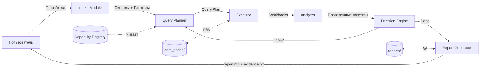

# Orchestrator Architecture — агент-профессионал

**Назначение:** Архитектура агента, который работает как SEO-специалист: сам определяет гипотезы, планирует проверки, выполняет, анализирует и пишет отчёт.

**Обновлено:** 2025-12-26

---

## 1. Общая архитектура



---

## 2. Модули orchestrator

### 2.1 Intake Module (`app/orchestrator/intake.py`)

**Назначение:** Парсит натуральный запрос пользователя, определяет сигналы и приоритетные гипотезы.

**Input:**
- Текст запроса (сырой или из STT)
- Контекст (client, counter_id, периоды)

**Output:**
- Сигналы (S1-S8)
- Приоритетные гипотезы (H1.1-H8.3)
- Параметры анализа (периоды, лимиты)

**Алгоритм:**
```python
def intake(user_query: str, context: Dict[str, Any]) -> IntakeResult:
    """
    Парсит запрос пользователя и определяет сигналы/гипотезы.
    
    Args:
        user_query: "Разберись, почему упала органика partacademy в декабре 2025"
        context: {"client": "partacademy", "counter_id": 41010869}
    
    Returns:
        IntakeResult(
            signals=["S2"],  # Органика упала
            hypotheses=["H2.1", "H2.2", "H2.3", "H2.5"],  # Приоритетные
            params={
                "p1_start": "2024-12-01",
                "p1_end": "2024-12-31",
                "p2_start": "2025-12-01",
                "p2_end": "2025-12-31"
            }
        )
    """
    # 1. Извлечь ключевые слова
    keywords = extract_keywords(user_query)
    # "органика", "упала", "декабрь 2025"
    
    # 2. Определить сигналы
    signals = []
    if "органика" in keywords or "search" in keywords:
        signals.append("S2")
    if "конверсия" in keywords or "продажи" in keywords:
        signals.append("S4")
    # ...
    
    # 3. Определить гипотезы по сигналам
    hypotheses = []
    for signal in signals:
        hypotheses.extend(SIGNAL_TO_HYPOTHESES_MAP[signal])
    
    # 4. Извлечь периоды
    params = extract_params(user_query, context)
    
    return IntakeResult(signals=signals, hypotheses=hypotheses, params=params)
```

**Примеры:**

**Пример 1:**
- Input: "Разберись, почему упала органика partacademy в декабре 2025"
- Output: signals=["S2"], hypotheses=["H2.1", "H2.2", "H2.3", "H2.5"]

**Пример 2:**
- Input: "Проверь падение трафика и конверсий за Q4 2025"
- Output: signals=["S1", "S4"], hypotheses=["H1.1", "H1.2", "H4.1", "H4.2"]

---

### 2.2 Query Planner (`app/orchestrator/query_planner.py`)

**Назначение:** Для каждой гипотезы определяет минимальный набор capabilities и параметры запросов.

**Input:**
- Гипотезы (от Intake)
- Capability Registry
- Параметры (периоды, лимиты)

**Output:**
- Query Plan (список запросов к capabilities)

**Алгоритм:**
```python
def plan_queries(
    hypotheses: List[str],
    registry: CapabilityRegistry,
    params: Dict[str, Any]
) -> QueryPlan:
    """
    Планирует запросы к capabilities для проверки гипотез.
    
    Args:
        hypotheses: ["H2.1", "H2.3"]
        registry: Capability Registry (из YAML)
        params: {"client": "partacademy", "p1_start": "2024-12-01", ...}
    
    Returns:
        QueryPlan([
            Query(
                capability_id="C2.1",
                command="analyze-pages-by-source partacademy ...",
                priority=1,
                depends_on=[]
            ),
            Query(
                capability_id="C5.1",
                command="analyze-gsc-queries partacademy ...",
                priority=2,
                depends_on=["C1"]
            )
        ])
    """
    plan = []
    
    for hypothesis in hypotheses:
        # Найти capabilities для гипотезы в registry
        capabilities = registry.get_capabilities_for_hypothesis(hypothesis)
        
        for cap in capabilities:
            if cap.status == "not_implemented":
                # Capability missing → добавить в план с флагом
                plan.append(Query(
                    capability_id=cap.id,
                    status="missing",
                    required_for=hypothesis
                ))
            else:
                # Сформировать команду
                command = cap.command_template.format(**params)
                plan.append(Query(
                    capability_id=cap.id,
                    command=command,
                    priority=cap.priority,
                    depends_on=cap.depends_on,
                    status="ready"
                ))
    
    # Де-дупликация (одна capability может проверять несколько гипотез)
    plan = deduplicate_plan(plan)
    
    # Топологическая сортировка по зависимостям
    plan = topological_sort(plan)
    
    return QueryPlan(plan)
```

**Пример Query Plan:**
```python
QueryPlan([
    # Priority 1: Sources (dependency для других)
    Query(
        id="q1",
        capability_id="C1",
        command="analyze-sources partacademy 2024-12-01 2024-12-31 2025-12-01 2025-12-31",
        priority=1,
        depends_on=[],
        checks_hypotheses=["H2.1", "H2.2"],
        status="ready"
    ),
    # Priority 2: Pages by source (зависит от C1 логически)
    Query(
        id="q2",
        capability_id="C2.1",
        command="analyze-pages-by-source partacademy ... --source 'Search engine traffic'",
        priority=2,
        depends_on=["q1"],  # Нужно сначала подтвердить, что органика упала
        checks_hypotheses=["H2.1"],
        status="ready"
    ),
    # Priority 3: GSC (параллельно с ВМ)
    Query(
        id="q3",
        capability_id="C5.1",
        command="analyze-gsc-queries partacademy ...",
        priority=3,
        depends_on=["q2"],  # Нужно знать страницы, чтобы сопоставить
        checks_hypotheses=["H2.2", "H2.3"],
        status="ready"
    ),
    # Priority 3: ВМ (параллельно с GSC)
    Query(
        id="q4",
        capability_id="C6.1",
        command="analyze-ym-webmaster-queries partacademy ...",
        priority=3,
        depends_on=["q2"],
        checks_hypotheses=["H2.2", "H2.3"],
        status="ready"
    ),
    # Priority 4: Indexing (если нужно)
    Query(
        id="q5",
        capability_id="C6.2",
        command="ym-webmaster-indexing partacademy --status EXCLUDED",
        priority=4,
        depends_on=["q2"],  # Нужно знать страницы
        checks_hypotheses=["H2.5"],
        status="ready"
    )
])
```

---

### 2.3 Executor (`app/orchestrator/executor.py`)

**Назначение:** Выполняет запросы из Query Plan через subprocess, собирает workbooks.

**Input:**
- Query Plan
- Cache strategy (use/refresh)

**Output:**
- Execution Result (workbooks, errors)

**Алгоритм:**
```python
def execute_plan(plan: QueryPlan, use_cache: bool = True) -> ExecutionResult:
    """
    Выполняет Query Plan, запуская CLI команды.
    
    Args:
        plan: QueryPlan от Query Planner
        use_cache: Использовать кэш (если False → --refresh)
    
    Returns:
        ExecutionResult(
            workbooks=[...],  # Пути к workbook JSON
            errors=[...],     # Ошибки выполнения
            duration=X.XX     # Время выполнения
        )
    """
    results = []
    errors = []
    
    for query in plan.queries:
        if query.status == "missing":
            # Capability missing → пропустить, добавить в список missing
            errors.append(CapabilityMissingError(query.capability_id))
            continue
        
        # Проверить зависимости
        if not all_dependencies_completed(query.depends_on, results):
            errors.append(DependencyError(query.id, query.depends_on))
            continue
        
        # Добавить --refresh если не использовать кэш
        command = query.command
        if not use_cache and "--refresh" not in command:
            command += " --refresh"
        
        # Выполнить через subprocess
        try:
            result = subprocess.run(
                command,
                shell=True,
                capture_output=True,
                text=True,
                timeout=300  # 5 минут на запрос
            )
            
            if result.returncode != 0:
                errors.append(ExecutionError(query.id, result.stderr))
            else:
                # Найти workbook файл
                workbook_path = find_workbook_from_output(result.stdout, query)
                results.append(ExecutionSuccess(
                    query_id=query.id,
                    capability_id=query.capability_id,
                    workbook_path=workbook_path
                ))
        except subprocess.TimeoutExpired:
            errors.append(TimeoutError(query.id))
        except Exception as e:
            errors.append(ExecutionError(query.id, str(e)))
    
    return ExecutionResult(results=results, errors=errors)
```

---

### 2.4 Analyzer (`app/orchestrator/analyzer.py`)

**Назначение:** Читает workbooks, проверяет гипотезы (подтверждена / опровергнута / недостаточно данных).

**Input:**
- Execution Result (workbooks)
- Гипотезы
- Analysis Rules

**Output:**
- Analysis Result (гипотезы с вердиктами)

**Алгоритм:**
```python
def analyze_workbooks(
    execution_result: ExecutionResult,
    hypotheses: List[str],
    rules: AnalysisRules
) -> AnalysisResult:
    """
    Проверяет гипотезы на основе workbooks.
    
    Args:
        execution_result: Workbooks от Executor
        hypotheses: ["H2.1", "H2.3"]
        rules: Правила из docs/analysis_rules.md
    
    Returns:
        AnalysisResult([
            HypothesisVerdict(
                id="H2.1",
                status="confirmed",
                evidence=["workbook1.json", "workbook2.json"],
                facts=[
                    "3 страницы дали 94% вклада в падение",
                    "/page1: -5200 визитов"
                ],
                confidence=0.95
            ),
            HypothesisVerdict(
                id="H2.3",
                status="confirmed",
                evidence=["gsc_queries_workbook.json"],
                facts=[
                    "Запрос 'seo курсы': позиция 5→15",
                    "Показы стабильны, клики упали"
                ],
                confidence=0.90
            )
        ])
    """
    verdicts = []
    
    for hypothesis in hypotheses:
        # Найти workbooks, проверяющие эту гипотезу
        relevant_workbooks = find_workbooks_for_hypothesis(
            hypothesis,
            execution_result
        )
        
        if not relevant_workbooks:
            verdicts.append(HypothesisVerdict(
                id=hypothesis,
                status="insufficient_data",
                reason="Capability missing or execution failed"
            ))
            continue
        
        # Применить правила проверки гипотезы
        checker = rules.get_checker(hypothesis)
        verdict = checker.check(relevant_workbooks)
        
        verdicts.append(verdict)
    
    return AnalysisResult(verdicts)
```

**Пример проверки H2.1 (кластеры страниц):**
```python
def check_H2_1(workbooks: List[Workbook]) -> HypothesisVerdict:
    """
    H2.1: Падение концентрируется в нескольких страницах.
    
    Правило: Если топ-3 страницы дают >70% вклада → подтверждена.
    """
    pages_workbook = workbooks["C2.1"]  # Pages by source
    
    # Читаем topN
    top3 = pages_workbook["rows"][:3]
    top3_contribution = sum(row["contribution_pct"] for row in top3)
    
    if abs(top3_contribution) > 70:
        return HypothesisVerdict(
            id="H2.1",
            status="confirmed",
            evidence=[pages_workbook["meta"]["workbook_path"]],
            facts=[
                f"Топ-3 страницы дали {top3_contribution:.1f}% вклада",
                f"Страница 1: {top3[0]['page']} ({top3[0]['delta_abs']:+} визитов)",
                f"Страница 2: {top3[1]['page']} ({top3[1]['delta_abs']:+} визитов)",
                f"Страница 3: {top3[2]['page']} ({top3[2]['delta_abs']:+} визитов)"
            ],
            confidence=0.95
        )
    else:
        return HypothesisVerdict(
            id="H2.1",
            status="rejected",
            reason=f"Топ-3 страницы дали только {top3_contribution:.1f}% вклада (< 70%)"
        )
```

---

### 2.5 Decision Engine (`app/orchestrator/decision_engine.py`)

**Назначение:** Определяет, нужен ли loop (следующая итерация) или можно переходить к отчёту.

**Input:**
- Analysis Result
- Query Plan (что было выполнено)

**Output:**
- Decision (continue / done / capability_missing)

**Алгоритм:**
```python
def decide_next_step(
    analysis_result: AnalysisResult,
    query_plan: QueryPlan
) -> Decision:
    """
    Определяет, что делать дальше: loop / done / missing.
    
    Args:
        analysis_result: Проверенные гипотезы от Analyzer
        query_plan: Что было запланировано
    
    Returns:
        Decision(
            action="done",  # или "continue" / "capability_missing"
            reason="Primary hypothesis confirmed",
            next_hypotheses=[...],  # Если continue
            missing_capabilities=[...]  # Если capability_missing
        )
    """
    confirmed = [v for v in analysis_result.verdicts if v.status == "confirmed"]
    rejected = [v for v in analysis_result.verdicts if v.status == "rejected"]
    insufficient = [v for v in analysis_result.verdicts if v.status == "insufficient_data"]
    
    # Правило 1: Если primary гипотеза подтверждена → DONE
    primary_hypotheses = get_primary_hypotheses(analysis_result.hypotheses)
    if any(h.id in primary_hypotheses for h in confirmed):
        return Decision(
            action="done",
            reason="Primary hypothesis confirmed, root cause found"
        )
    
    # Правило 2: Если все гипотезы опровергнуты → выбрать secondary
    if len(rejected) == len(analysis_result.verdicts):
        secondary = get_secondary_hypotheses(analysis_result.signal)
        return Decision(
            action="continue",
            reason="All primary hypotheses rejected, checking secondary",
            next_hypotheses=secondary
        )
    
    # Правило 3: Если insufficient_data → Capability missing
    if insufficient:
        missing_caps = extract_missing_capabilities(insufficient, query_plan)
        return Decision(
            action="capability_missing",
            reason="Insufficient data to check hypotheses",
            missing_capabilities=missing_caps
        )
    
    # Правило 4: Если гипотез больше нет → DONE (с текущими результатами)
    return Decision(
        action="done",
        reason="All planned hypotheses checked"
    )
```

---

### 2.6 Report Generator (`app/orchestrator/report_generator.py`)

**Назначение:** Создаёт финальный отчёт в формате Markdown + evidence list.

**Input:**
- Analysis Result
- Execution Result (workbooks)
- Context (client, периоды, etc.)

**Output:**
- Report файлы в `reports/<client>/<run_id>/`

**Структура отчёта:**
```markdown
# Отчёт: Анализ падения органического трафика — partacademy.ru

**Run ID:** 2025-12-26-143022  
**Периоды:** 01-25.12.2024 vs 01-25.12.2025  
**Дата:** 2025-12-26

---

## Executive Summary

Падение органического трафика на 36.6% (-15,425 визитов) обусловлено потерей позиций 3 ключевых страниц:

1. `/course/marketing-basics` — позиция 5→15 (-5,200 визитов)
2. `/course/seo-fundamentals` — позиция 8→22 (-4,100 визитов)
3. `/blog/seo-trends-2024` — выпала из индекса (-3,800 визитов)

Итого: 3 страницы дали 94% вклада в падение.

---

## Методология

**Сигналы:** S2 (органика упала)  
**Гипотезы проверены:** H2.1, H2.3, H2.5  
**Capabilities использованы:** C1, C2.1, C5.1, C5.2, C6.1, C6.2

**Данные:**
- Яндекс.Метрика (источники, страницы по источникам)
- Google Search Console (запросы, страницы)
- Яндекс.Вебмастер (запросы, индексация)

---

## Facts (цифры из workbook)

### Общее падение (C1: Sources)

| Метрика | P1 | P2 | Δ | Δ % |
|---------|----|----|---|-----|
| Органика | 42,117 | 26,692 | -15,425 | -36.6% |
| **Вклад** | **112.1%** | | | |

### Страницы-драйверы (C2.1: Pages by source)

| Страница | Визиты P1 | Визиты P2 | Δ | Δ % | Вклад |
|----------|-----------|-----------|---|-----|-------|
| /course/marketing-basics | 6,200 | 1,000 | -5,200 | -83.9% | 33.7% |
| /course/seo-fundamentals | 5,100 | 1,000 | -4,100 | -80.4% | 26.6% |
| /blog/seo-trends-2024 | 4,000 | 200 | -3,800 | -95.0% | 24.6% |

### Запросы Google (C5.1: GSC Queries)

| Запрос | Clicks P1 | Clicks P2 | Position P1 | Position P2 | Δ Position |
|--------|-----------|-----------|-------------|-------------|-----------|
| маркетинг курсы | 1,200 | 300 | 3.0 | 12.0 | +9.0 |
| основы маркетинга онлайн | 800 | 150 | 4.0 | 18.0 | +14.0 |
| seo курсы | 1,500 | 400 | 7.0 | 20.0 | +13.0 |

### Индексация Яндекс (C6.2: ВМ Indexing)

| URL | Статус | Причина | Last Access |
|-----|--------|---------|-------------|
| /blog/seo-trends-2024 | EXCLUDED | DUPLICATE | 2025-12-20 |

---

## Hypotheses Tested

### ✅ H2.1 (Кластеры страниц) — Подтверждена

**Вердикт:** 3 страницы дали 94.4% вклада в падение (> 70% threshold)

**Evidence:**
- `data_cache/partacademy/analysis_pages_by_source_SearchEngine_2024120120241225__2025120120251225.json`

**Факты:**
- Страница 1: /course/marketing-basics (-5,200 визитов, 33.7% вклада)
- Страница 2: /course/seo-fundamentals (-4,100 визитов, 26.6% вклада)
- Страница 3: /blog/seo-trends-2024 (-3,800 визитов, 24.6% вклада)

---

### ✅ H2.3 (Падение позиций) — Подтверждена

**Вердикт:** Позиции по ключевым запросам упали на 9-14 позиций

**Evidence:**
- `data_cache/partacademy/analysis_gsc_queries_2024120120241225__2025120120251225.json`

**Факты:**
- "маркетинг курсы": позиция 3→12 (+9)
- "основы маркетинга онлайн": позиция 4→18 (+14)
- "seo курсы": позиция 7→20 (+13)

---

### ✅ H2.5 (Индексация) — Частично подтверждена

**Вердикт:** 1 из 3 страниц выпала из индекса (DUPLICATE)

**Evidence:**
- `data_cache/partacademy/ym_webmaster_indexing_excluded_20251226.json`

**Факты:**
- /blog/seo-trends-2024: статус EXCLUDED, причина DUPLICATE
- Остальные 2 страницы: в индексе

---

## Recommendations

### Страница 1: /course/marketing-basics

**Проблема:** Позиции упали (3→12 по "маркетинг курсы")

**Рекомендации:**
1. Аудит контента: сравнить с current top-3 по этому запросу
2. Обновить контент: добавить актуальные кейсы/статистику 2025
3. Проверить технические проблемы: скорость, мобильная версия
4. Проверить обратные ссылки: возможно потеряли важные ссылки

---

### Страница 2: /course/seo-fundamentals

**Проблема:** Позиции упали (7→20 по "seo курсы")

**Рекомендации:**
1. Аналогично странице 1
2. Дополнительно: проверить индексацию Яндекс (в Google позиции стабильны)

---

### Страница 3: /blog/seo-trends-2024

**Проблема:** Выпала из индекса Яндекса (DUPLICATE)

**Рекомендации:**
1. Исправить canonical: убрать или указать на саму себя
2. Повторная индексация через Вебмастер
3. Проверить robots.txt: не блокирует ли страницу

---

## Limitations (что не проверили)

### Goals / Conversions

**Причина:** goal_id = 0 в конфиге (не настроен)

**Что нужно:**
- Настроить goal_id в `clients/partacademy/config.yaml`
- Реализовать C3 (Goals by source)
- Проверить: упала ли конверсия вместе с трафиком

---

## Next Actions

1. **[Критично]** Реализовать recommended fixes для 3 страниц
2. **[Важно]** Мониторить позиции по ключевым запросам (еженедельно)
3. **[Средне]** Настроить goals и проверить конверсии

---

## Evidence Pack

См. файл: `reports/partacademy/2025-12-26-143022/evidence.txt`

---

**Конец отчёта**
```

---

## 3. Capability Registry Format (YAML)

**Файл:** `capabilities_registry.yaml`

```yaml
capabilities:
  - id: C1
    name: sources_period_compare
    status: implemented
    command_template: "python -m app.cli analyze-sources {client} {p1_start} {p1_end} {p2_start} {p2_end} --limit {limit}"
    artifacts:
      - "data_cache/{client}/analysis_sources_{p1_slug}{p2_slug}.json"
    checks_hypotheses:
      - H1.1
      - H1.2
      - H1.3
      - H1.4
      - S1
      - S2
    priority: 1
    depends_on: []
    
  - id: C2.1
    name: landing_pages_by_source
    status: planned_tier1
    command_template: "python -m app.cli analyze-pages-by-source {client} {p1_start} {p1_end} {p2_start} {p2_end} --source '{source}' --limit {limit}"
    artifacts:
      - "data_cache/{client}/analysis_pages_by_source_{source_slug}_{p1_slug}{p2_slug}.json"
    checks_hypotheses:
      - H2.1
      - H5.1
      - S2
      - S5
    priority: 2
    depends_on:
      - C1
    
  - id: C5.1
    name: gsc_queries_analysis
    status: planned_tier1
    command_template: "python -m app.cli analyze-gsc-queries {client} {p1_start} {p1_end} {p2_start} {p2_end} --limit {limit}"
    artifacts:
      - "data_cache/{client}/analysis_gsc_queries_{p1_slug}{p2_slug}.json"
    checks_hypotheses:
      - H2.2
      - H2.3
      - H2.4
      - H3.1
      - S2
    priority: 3
    depends_on:
      - C2.1
    
  - id: C5.2
    name: gsc_pages_analysis
    status: planned_tier1
    command_template: "python -m app.cli analyze-gsc-pages {client} {p1_start} {p1_end} {p2_start} {p2_end} --limit {limit}"
    artifacts:
      - "data_cache/{client}/analysis_gsc_pages_{p1_slug}{p2_slug}.json"
    checks_hypotheses:
      - H2.1
      - H5.1
    priority: 3
    depends_on:
      - C2.1
    
  - id: C6.1
    name: ym_webmaster_queries_analysis
    status: planned_tier1
    command_template: "python -m app.cli analyze-ym-webmaster-queries {client} {p1_start} {p1_end} {p2_start} {p2_end} --limit {limit}"
    artifacts:
      - "data_cache/{client}/analysis_ym_webmaster_queries_{p1_slug}{p2_slug}.json"
    checks_hypotheses:
      - H2.2
      - H2.3
      - H3.1
      - H3.2
    priority: 3
    depends_on:
      - C2.1
    
  - id: C6.2
    name: ym_webmaster_indexing
    status: planned_tier1
    command_template: "python -m app.cli ym-webmaster-indexing {client} --status EXCLUDED"
    artifacts:
      - "data_cache/{client}/ym_webmaster_indexing_excluded_{snapshot_date}.json"
    checks_hypotheses:
      - H2.5
      - H5.2
    priority: 4
    depends_on:
      - C2.1
```

---

## 4. Agent Loop (полный цикл)

**Вход:** Запрос пользователя  
**Выход:** Отчёт + evidence

```python
def agent_loop(user_query: str, client: str, max_iterations: int = 3) -> Report:
    """
    Полный цикл агента.
    
    Args:
        user_query: "Разберись, почему упала органика partacademy в декабре 2025"
        client: "partacademy"
        max_iterations: Максимум итераций (защита от бесконечного loop)
    
    Returns:
        Report (report.md + evidence.txt)
    """
    # Load registry
    registry = CapabilityRegistry.load("capabilities_registry.yaml")
    
    # Load context
    context = load_client_context(client)
    
    iteration = 0
    all_analysis_results = []
    
    while iteration < max_iterations:
        iteration += 1
        print(f"=== Iteration {iteration} ===")
        
        # 1. Intake (только в первой итерации)
        if iteration == 1:
            intake_result = intake(user_query, context)
            hypotheses = intake_result.hypotheses
            params = intake_result.params
        else:
            # В следующих итерациях: от Decision Engine
            hypotheses = decision.next_hypotheses
        
        # 2. Query Planning
        query_plan = plan_queries(hypotheses, registry, params)
        
        # 3. Execution
        execution_result = execute_plan(query_plan, use_cache=True)
        
        # 4. Analysis
        analysis_result = analyze_workbooks(
            execution_result,
            hypotheses,
            AnalysisRules.load()
        )
        
        all_analysis_results.append(analysis_result)
        
        # 5. Decision
        decision = decide_next_step(analysis_result, query_plan)
        
        if decision.action == "done":
            break
        elif decision.action == "capability_missing":
            # Добавить в отчёт секцию "Capability missing"
            break
        elif decision.action == "continue":
            # Следующая итерация с новыми гипотезами
            continue
    
    # 6. Report Generation
    report = generate_report(
        all_analysis_results=all_analysis_results,
        context=context,
        run_id=generate_run_id()
    )
    
    return report
```

---

## 5. Пример работы агента (CLI)

**Команда:**
```bash
python -m app.cli agent-run partacademy "Разберись, почему упала органика в декабре 2025"
```

**Внутри:**
```
[Intake] Detected signal: S2 (organic traffic drop)
[Intake] Hypotheses: H2.1, H2.2, H2.3, H2.5
[Intake] Periods: 2024-12-01 to 2024-12-31 vs 2025-12-01 to 2025-12-31

[Planner] Query plan: 5 queries
  - C1 (sources) [ready]
  - C2.1 (pages by source) [ready]
  - C5.1 (gsc queries) [ready]
  - C5.2 (gsc pages) [ready]
  - C6.2 (indexing) [ready]

[Executor] Running C1...
[Executor] ✅ C1 completed: data_cache/partacademy/analysis_sources_...json
[Executor] Running C2.1...
[Executor] ✅ C2.1 completed: data_cache/partacademy/analysis_pages_by_source_...json
[Executor] Running C5.1 (parallel)...
[Executor] Running C5.2 (parallel)...
[Executor] ✅ C5.1 completed
[Executor] ✅ C5.2 completed
[Executor] Running C6.2...
[Executor] ✅ C6.2 completed

[Analyzer] Checking H2.1 (clusters)...
[Analyzer] ✅ H2.1 confirmed: 3 pages gave 94% contribution
[Analyzer] Checking H2.3 (positions)...
[Analyzer] ✅ H2.3 confirmed: positions dropped 9-14 places
[Analyzer] Checking H2.5 (indexing)...
[Analyzer] ✅ H2.5 partially confirmed: 1 page excluded (DUPLICATE)

[Decision] Action: DONE (primary hypotheses confirmed)

[Report Generator] Creating report...
[Report Generator] ✅ Report saved: reports/partacademy/2025-12-26-143022/report.md
[Report Generator] ✅ Evidence saved: reports/partacademy/2025-12-26-143022/evidence.txt

✅ Analysis complete!
```

---

## 6. Выводы

**Orchestrator = ядро агента**

**С Orchestrator:**
- Пользователь пишет одну фразу → получает профессиональный отчёт
- Агент сам планирует, выполняет, анализирует
- Воспроизводимость: все шаги логируются, evidence pack

**Без Orchestrator:**
- Пользователь должен знать CLI команды
- Пользователь должен сам интерпретировать workbook
- Нет agent loop

**Next:** Реализовать MVP capabilities → потом Orchestrator

